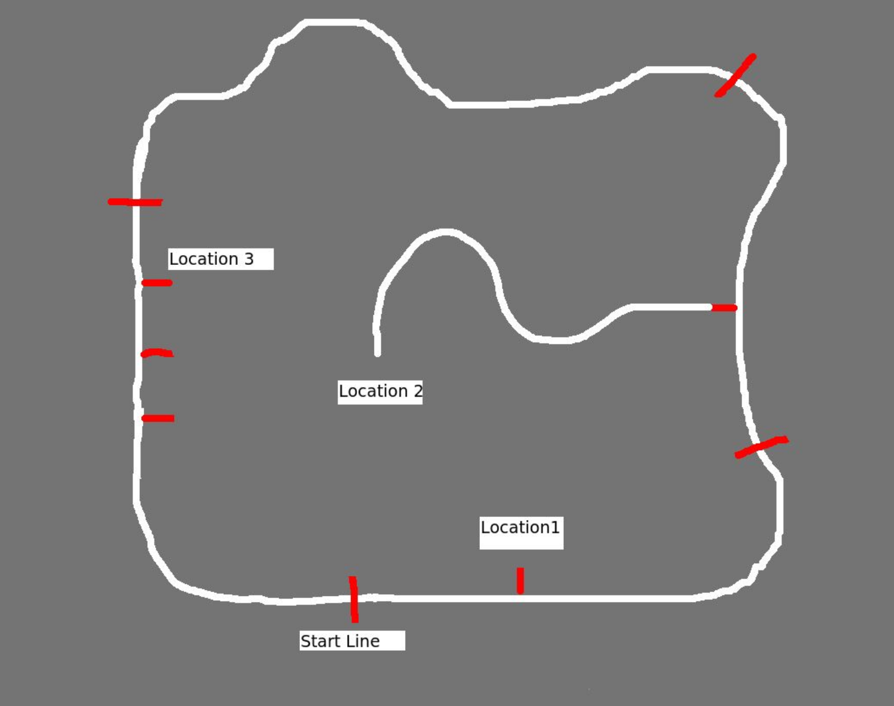
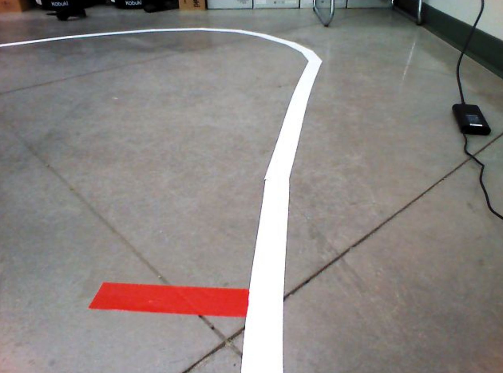
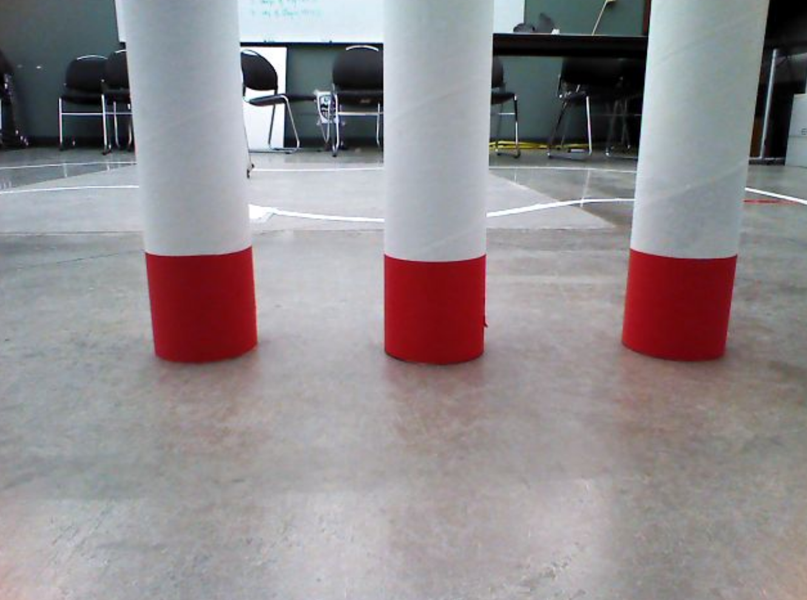
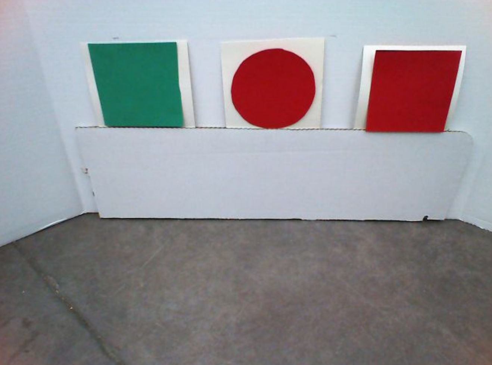
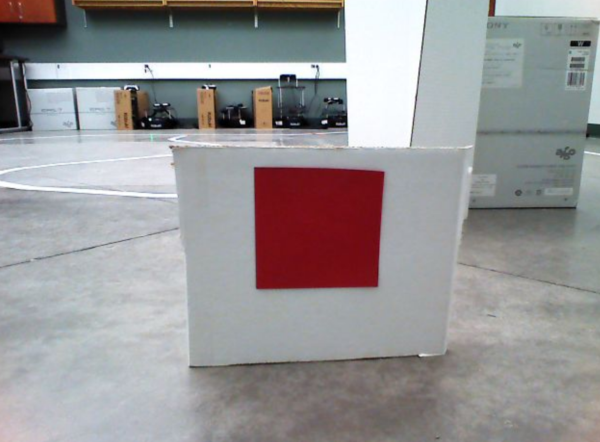
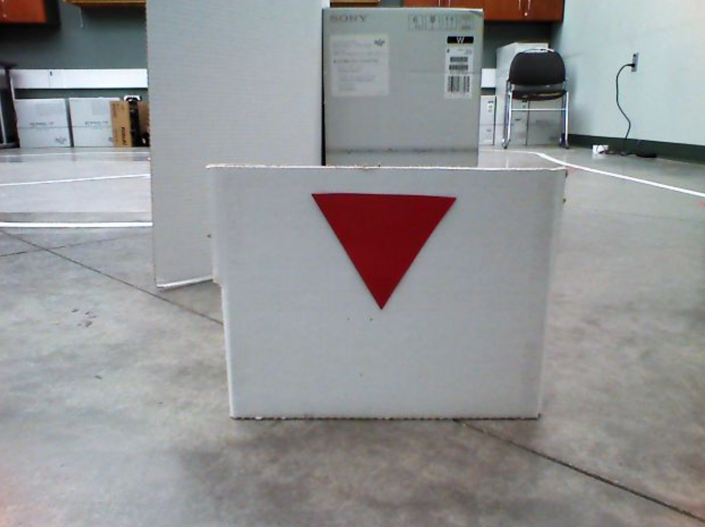
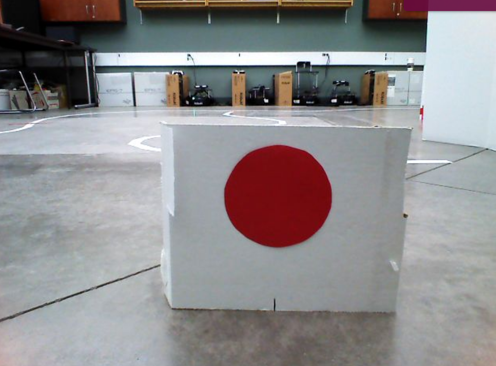
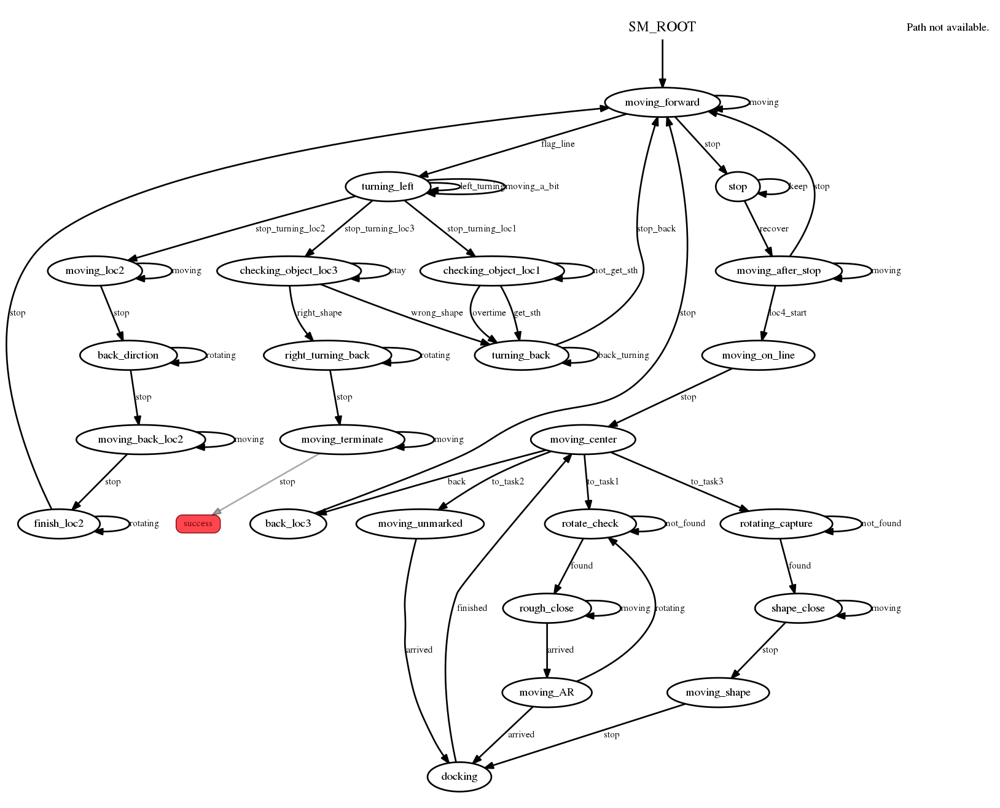

# line-following robot
* This project is intended for competition #3 in CMPUT 412 at University of Alberta. All rights reserved.

## Purpose
This project is a warehouse robot prototype using vision signal.
A race track shaped loop with a solid white line marks the path to follow in our use case.
When travelling in the counterclockwise (CCW) direction, red stop lines indicate where the robot should stop.
The robot will be initially place in full stop at the first stop line.
The robot stays on the line while looping around the track.
There are four stop lines, once the robot has done a full loop and reach the start stop line the run is done.
There are 4 locations for specific tasks.

<p align="center">
 
</p>

* Location 1 is marked by a short red line adjacent to the track, the robot a number of objects (one, two, or three) at this location, and signal with LEDs(same as number of objects counted), and beep for the same number of time.

<p align="center">
 
 
</p>

* Location 2 is down a detour, marked by a red line adjacent to the track, the robot will count the number of objects (one, two, or three), and signal with LEDs(same as number of objects counted), and beep for the same number of time.
Only one of the objects will appear in green color, the robot will memorize the shape of this object.

<p align="center">
 
</p>

* Location 3 has three separate red line markers, one for each shape (square, circle, triangle). The robot will look for the same shape it memorized from the green object at location 2, and signal with LED and beep sound indicating the match.

<p align="center">
 
 
 
</p>

* Location 4 is off-ramp a "parking lot". The robot will complete three tasks in this location. First, docking in front of a random AR tag; Second, docking in a random square set by joy sticks; Third, docking in front of the same shape that it memorized from the green object at location 2.

<p align="center">
 
</p>

## Prerequisite
- This project is developed and tested under [Ubuntu 16.4](https://www.ubuntu.com/download/alternative-downloads) and [ROS Kinetic](http://wiki.ros.org/kinetic) platform.
- This project is to be executed on [kobuki turtlebot](https://www.turtlebot.com/turtlebot2/).
- [openni2 camera](http://wiki.ros.org/openni_camera) and [launch](http://wiki.ros.org/openni2_launch) packages.
- [OpenCv](http://wiki.ros.org/vision_opencv) package should be installed.

## Installation
Open a terminal and type the following bash commands in order

First, clone the release branch of this workspace repoisitory to the directory of your choice
```sh
git clone --single-branch --branch release https://github.com/stwklu/CMPUT_412_code.git

```

Make the packages
```sh
cd CMPUT_412_code
catkin_make
```

## Usage example
Open three terminals, and type each the following command in one of the terminal windows

Before doing so, you should source the setup file in each of the terminals by typing
```sh
source devel/setup.bash
```

In the first terminal, invoke roscore
```sh
roscore
```
In the second terminal, bring up the [turtlebot](https://www.turtlebot.com/turtlebot2/)
```sh
roslaunch turtlebot_bringup minimal.launch
```
In the third terminal, bring up the sensors
```sh
roslaunch turtlebot_bringup 3dsensor.launch
```
Now you should have the turtlebot activated.

Open another terminal, launch the package. Make sure the source the setup script before as above
```sh
roslaunch line_follow_count line_follow_count.launch
```

## Concept & Code
### launch file & parameters
The following parameters in the `line_follow_count.launch`:
* `max_rotate_vel: 0.5` : The maximum rotation velocity command being sent
* `max_linear_vel: 0.25` : The maximum linear velocity command being sent
* `degree_ninty: 2.0` : The radian degree to turned when turning turning the robot by 90 degree. Note this value is slightly higher than pi/2 due to robot mechanic errors.
* `loc3_stop_time: 2` : waiting time at location 3
* `time_after_stop: 2` : minimum time to go foward after stop. This prevent the robot re-identifying line stops.

### State machine
The state machine governing the execution of the whole task is constituted by and 
* **5 task states**. These states are used specifically for sequential sub-tasks, which involve counting objects, and identify shapes.
  * `moving_foward` : Moving forward until line stops. Task orders are managed by global flags.
  * `checking_object_loc1` : In this state the turtlebot counts the number of red objects/segments in vision. LED signial will indicate the number of objects counted.
  * `moving_loc2` : In this state, the robot would go into the path indicated by line stop, and count the number of geometric primitives presented at the end of line. The green geometric primitive is recorded as target.
  * `moving_back_loc2` & `finish_loc2` : In this state, the turtlebot exit the path and go back to the main route.
  * `checking_object_loc3` : In this state, the turtlebot check the geometric primitives on the left hand side of the route by order, and signal when the target observed at location 2 is presented.

* **7 utility states**. These states only execute basic robot movements that needed for bridging task states.
  * `turning_back` : Turn the turtlebot by 90 degree from clockwise.
  * `turning_left` : Turn the turtlebot by 90 degree counter-clockwise.
  * `right_turning_back` : Turn the turtlebot by 90 degree clockwise.
  * `moving_terminate` : Check all flags to determine if need to stop.
  * `back_dirction` : Turn the turtlebot by 180 degree from clockwise.
  * `stop` : Stop all robot movements.
  * `moving_after_stop` : Moving forward for 2 seconds.
To show the state machine graphically
<p align="center">
 
</p>

### Vision system
Vision sensor and image processing from [OpenCv](https://opencv.org/) package are mainly used for the following:
* Identify lines
  * Images from front camera are filtered to only passing white color. We use the image moment to compute forward direction via a PID controller, to stay on the route.
* Detecting and recognizing basic geometric primitives
  1. Find Contours in the image.
  2. Approximate each contour using OpenCv `approxPolyDP` function.
  3. Check number of elements in the approximated contours, determine the shape.


## Contributing

1. Fork it (<https://github.com/yourname/yourproject/fork>)
2. Create your feature branch (`git checkout -b feature/fooBar`)
3. Commit your changes (`git commit -am 'Add some fooBar'`)
4. Push to the branch (`git push origin feature/fooBar`)
5. Create a new Pull Request
